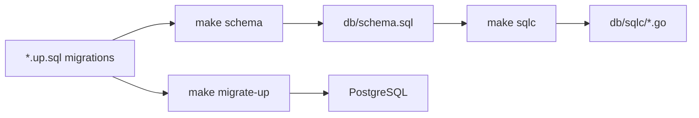

# sqlc Setup — Problem & Recommendations

## Problem

The project uses **sqlc** for PostgreSQL code generation, but a few pieces were unclear or broken:

### 1. `sqlc.yaml` options (lines 11–19)

It was unclear what these settings do and whether they are required:

- `emit_json_tags`
- `emit_empty_slices`
- `overrides` (UUID → `string`, TIMESTAMPTZ → `time.Time`)

### 2. Missing schema file

`sqlc.yaml` pointed to `db/schema.sql`, but that file **did not exist**. Running `sqlc generate` failed with:

```
stat db/schema.sql: no such file or directory
```

### 3. Two sources of truth

Schema lives in two places:

| Location | Purpose |
|----------|---------|
| `cmd/migrate/migrations/*.up.sql` | Applied to the database at runtime |
| `db/schema.sql` | Used by sqlc to generate Go code |

These were out of sync because `db/schema.sql` was never created.

---

## Recommendations

| Topic | Recommendation |
|-------|----------------|
| **`overrides`** | **Keep them.** They map `UUID` → `string` and `TIMESTAMPTZ` → `time.Time`, matching `types.User` and avoiding pgx wrapper types and manual conversion in `store.go`. |
| **`emit_json_tags`** | **Keep** if you may JSON-serialize sqlc models directly. Optional otherwise. |
| **`emit_empty_slices`** | **Keep** if you want `[]` instead of `null` in JSON for empty list queries. |
| **`db/schema.sql`** | **Create and maintain it.** It should reflect the **current** database shape, not migration history. |
| **Don't point sqlc at migrations** | Avoid using `cmd/migrate/migrations/` as the schema path — sqlc reads all `.sql` files there, including `.down.sql` (e.g. `DROP TABLE`), which breaks parsing. |

---

## Workflow

When you change the database schema:

1. **Add migration** → `cmd/migrate/migrations/xxx.up.sql`
2. **Run migrate up** → applies changes to PostgreSQL
3. **Update schema** → `db/schema.sql` (match new tables/columns)
4. **Regenerate code** → `make sqlc`

---

## Bottom line

- sqlc needs a **dedicated schema file** separate from migrations.
- Keep **`overrides`** aligned with domain types (`string` IDs, `time.Time` timestamps).
- Update **`db/schema.sql`** whenever you add a migration.

---

## Better approaches

The main pain point is **maintaining two schema copies by hand**. Here are better options, from most practical to most ambitious.

### 1. Auto-generate `schema.sql` from migrations (recommended)

Keep **migrations as the single source of truth**. Generate `db/schema.sql` automatically before `sqlc generate`:

```makefile
schema:
	@ls cmd/migrate/migrations/*.up.sql | sort | xargs cat > db/schema.sql

sqlc: schema
	sqlc generate
```

**Pros:** Minimal change to your current setup; no manual sync; still works offline.  
**Cons:** `schema.sql` is a generated artifact (add to `.gitignore` or commit it — either works).

This fits your existing `golang-migrate` + sqlc stack best.

---

### 2. Dedicated up-only schema directory

Point sqlc at a folder that contains **only** `.up.sql` files (no `.down.sql`):

```yaml
schema: "db/schema"
```

Options:

- Symlink or copy up migrations into `db/schema/`
- Or move migrations to `db/migrations/` and keep down files elsewhere

**Pros:** sqlc reads real migration SQL directly.  
**Cons:** Still duplication or symlink juggling unless you automate it (same as option 1).

---

### 3. sqlc `database.uri` (query analysis only)

```yaml
database:
  uri: "${DATABASE_URL}"
```

This connects to a live DB for **better query type-checking** — it does **not** replace `schema.sql`. You still need a schema file; the DB must already be migrated.

**Pros:** Catches query bugs sqlc can't see from static SQL alone.  
**Cons:** Requires a running, migrated database for `make sqlc`; doesn't solve schema duplication.

Use this **on top of** option 1, not instead of it.

---

### 4. Atlas (schema-first tooling)

Replace hand-written migrations with [Atlas](https://atlasgo.io/): define schema once, generate migrations, feed the same schema to sqlc.

**Pros:** One authoritative schema; strong diff/migration workflow at scale.  
**Cons:** New tool, new workflow; overkill for a small API with a few tables.

Consider when the project grows beyond a handful of migrations.

---

### 5. Manual `db/schema.sql` (current approach)

Edit `db/schema.sql` by hand after every migration.

**Pros:** Simple, no scripts.  
**Cons:** Easy to forget; schema and DB drift apart over time.

Fine for learning or a one-table prototype; avoid long-term.

---

## Recommendation for this project

| Priority | Action |
|----------|--------|
| **Do now** | Add a `schema` Makefile target that concatenates `*.up.sql` → `db/schema.sql`, and make `sqlc` depend on it |
| **Keep** | `overrides` in `sqlc.yaml` |
| **Later** | Add `database.uri` if queries get complex |
| **Skip for now** | Atlas, managed databases |


